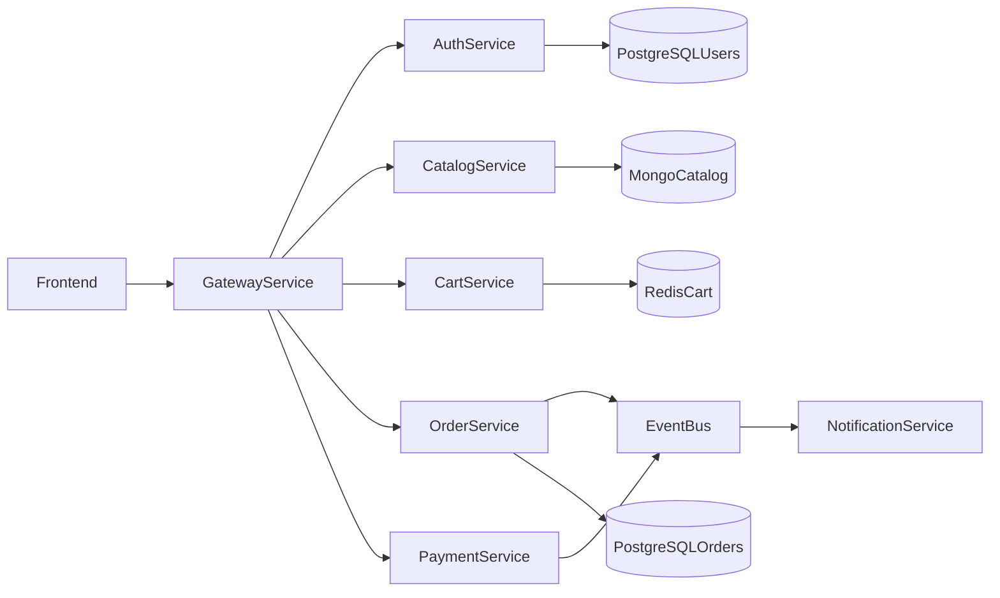

# Architecture and Data Ownership

## High-Level Architecture

## Data Ownership

- `auth` owns users, passwords, and JWT claims data.
- `catalog` owns product records and inventory metadata.
- `cart` owns transient cart state keyed by user.
- `order` owns immutable order snapshots and order status.
- `payment` owns payment transaction state (mocked).
- `notification` owns delivery logs and event processing status.

## Communication Model

- Synchronous: gateway to internal services over HTTP.
- Asynchronous: `order.created` and `payment.completed` events via broker.

## Reliability Decisions

- Gateway timeout and fallback handling for downstream errors.
- Idempotent order creation by client-provided request id (future enhancement).
- Event consumers designed to tolerate duplicate events.
