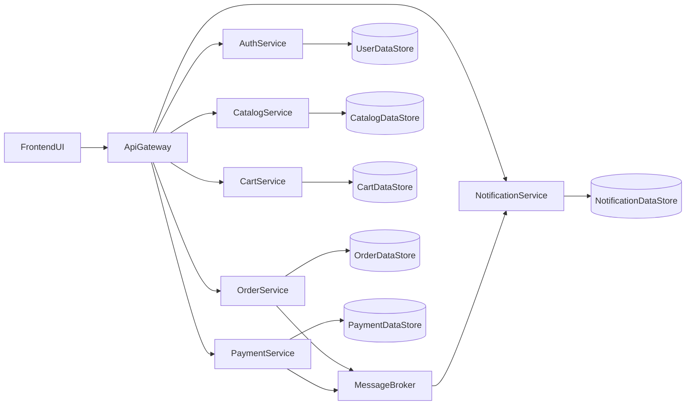
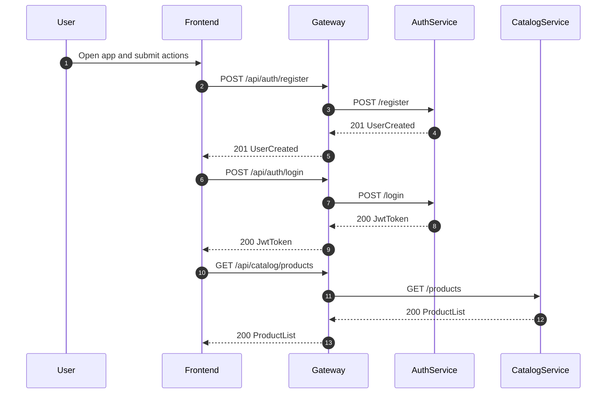
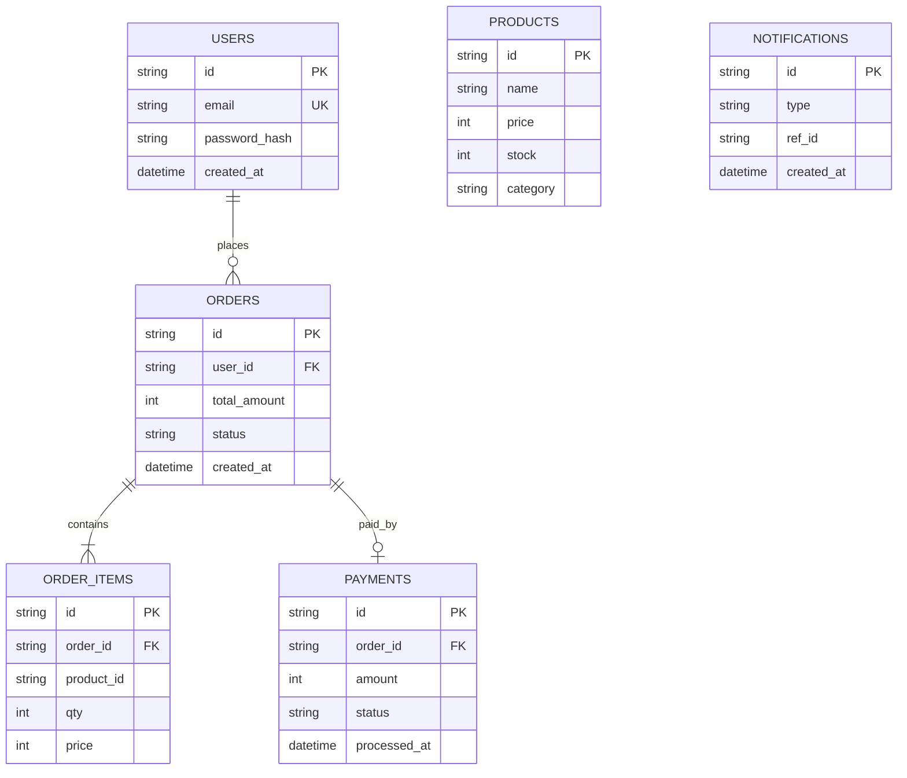
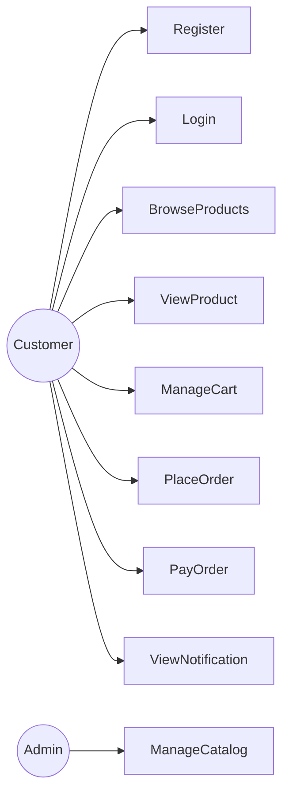
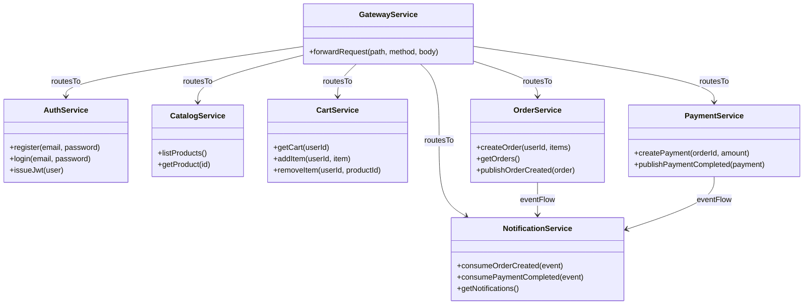

# CloudCommercX Detailed Report (Up to Review-1)

## 1) Project Overview

CloudCommercX is an SDP microservices-based e-commerce project built for learning modern backend architecture, service decomposition, API gateway routing, event-driven communication, and containerized deployment.  
This document captures the project status up to Review-1 and consolidates architecture, system design, database design, and UML in one report.

## 2) Problem Statement and Motivation

Traditional monolithic e-commerce applications become hard to maintain when features grow. A microservices approach allows each business capability to evolve independently, improves modularity, and supports clearer ownership of data and APIs.  
The project is intentionally designed as an educational production-style system with measurable milestones at each SDP review.

## 3) Objectives

### Functional Objectives

- User registration and login
- Product catalog listing and product detail lookup
- Cart operations (add/remove/list items)
- Order creation and payment simulation
- Notification generation from business events

### Learning Objectives

- Design bounded-context services and service contracts
- Implement gateway-based request routing
- Understand sync + async service communication
- Run and monitor a multi-service system

## 4) Scope Completed Till Review-1

### Completed Deliverables

- Scope freeze and service boundaries finalized
- Architecture and API contracts documented
- Implemented services:
  - Auth service
  - Catalog service
  - API gateway
  - Baseline frontend page for demo flow
- Health endpoints and metrics endpoints available
- Automated tests completed for:
  - auth + catalog flow
  - cart + order flow (prepared for next review milestone continuity)

### Key Evidence Files

- `docs/scope.md`
- `docs/architecture.md`
- `docs/api-contracts.md`
- `services/auth/src/index.js`
- `services/catalog/src/index.js`
- `services/gateway/src/index.js`
- `frontend/index.html`
- `tests/auth-catalog.test.js`

## 5) High-Level Architecture

### Architecture Notes

- Gateway is the single public entrypoint and routes `/api/*` requests to internal services.
- Services are independently deployable and expose health + metrics endpoints.
- Async flow is used for order and payment lifecycle events.

## 6) System Design

### 6.1 Service Boundaries

- **Auth Service**: registration, login, JWT issuance, user identity
- **Catalog Service**: product browsing and product details
- **Cart Service**: user cart state management
- **Order Service**: order placement and total calculation
- **Payment Service**: payment simulation and status publication
- **Notification Service**: event-driven notification record creation
- **Gateway Service**: centralized routing, downstream error handling

### 6.2 Communication Design

- **Synchronous (HTTP/REST)**: Client -> Gateway -> Target Service
- **Asynchronous (Event Bus)**: Order/Payment publish domain events -> Notification consumes

### 6.3 Request Flow (Review-1 Core)

### 6.4 Reliability and Error Handling

- Gateway returns `502` for unreachable downstream services.
- Service-level health endpoints enable quick fault isolation.
- Metrics endpoint in each service supports basic observability.

## 7) Database Design

## 7.1 Current (Implementation Status)

- Current code uses in-memory stores to accelerate development and demonstration.
- This allows fast iteration during early reviews.

## 7.2 Target Database Strategy (Recommended)

- **PostgreSQL (SQL)**:
  - Auth (users)
  - Order (orders + order_items)
  - Payment (transactions)
- **MongoDB (NoSQL)**:
  - Catalog (products with flexible attributes)
- **Redis (In-memory key-value)**:
  - Cart (fast, session-like cart state)

This mixed model is ideal for microservices and demonstrates technology-fit by domain.

## 7.3 Data Ownership Model

- Each service owns its database schema and writes directly only to its own store.
- Cross-service interaction happens through APIs/events, not shared table access.

## 7.4 ER Diagram (Target Logical Model)

## 8) UML Diagrams

### 8.1 UML Use Case Diagram (Logical)

### 8.2 UML Class Diagram (Service-Level Concept)

## 9) Testing Summary (Till Review-1)

- Automated tests passing:
  - `tests/auth-catalog.test.js`
  - `tests/cart-order.test.js`
- Basic manual validation:
  - Frontend button flow
  - Gateway health checks
  - Catalog load via API gateway

## 10) Risks and Mitigation

- **Risk**: service startup dependency mismatch in local environment  
  **Mitigation**: single `start:all` runner and health checks

- **Risk**: no persistent storage in early phase  
  **Mitigation**: staged migration to PostgreSQL + MongoDB + Redis

- **Risk**: Docker setup variance across machines  
  **Mitigation**: local no-Docker run path and clear setup commands

## 11) Work Plan After Review-1

- Replace in-memory stores with production-like DB adapters
- Strengthen auth and authorization checks
- Improve event reliability (retry, dead-letter strategy)
- Add more integration tests and API contract validation
- Run complete stack via Docker Compose once Docker is ready

## 12) Conclusion

Up to Review-1, the project has completed architecture definition and a functional baseline implementation with gateway routing and core services. The design is ready for progressive hardening in Review-2/3 through persistent databases, robust async flows, and full containerized deployment evidence.
